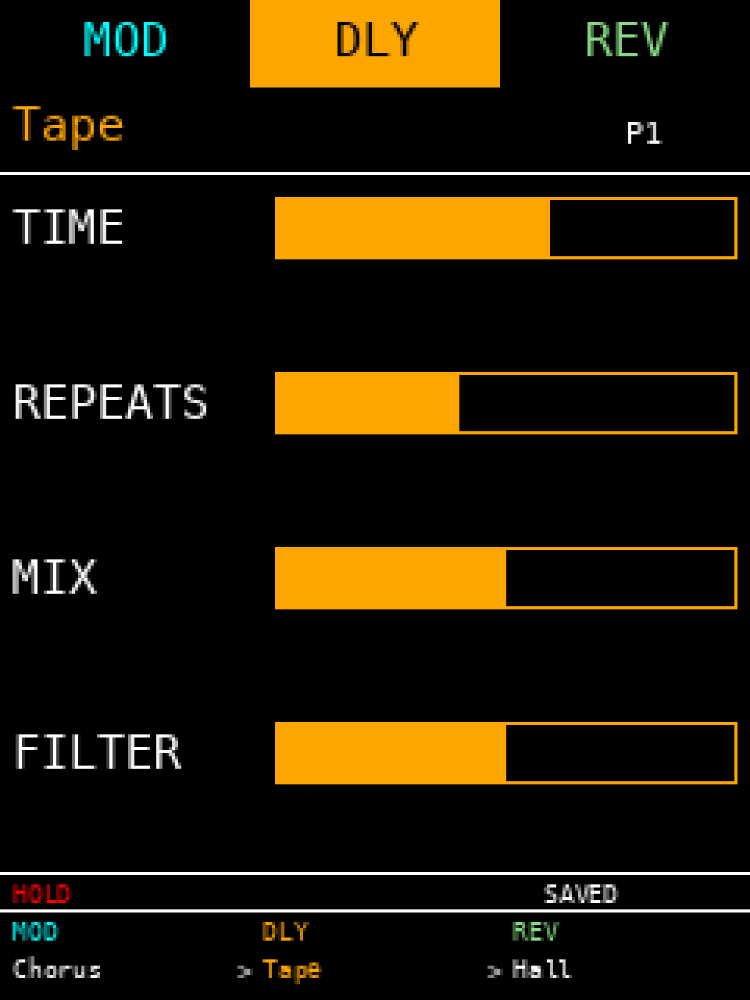
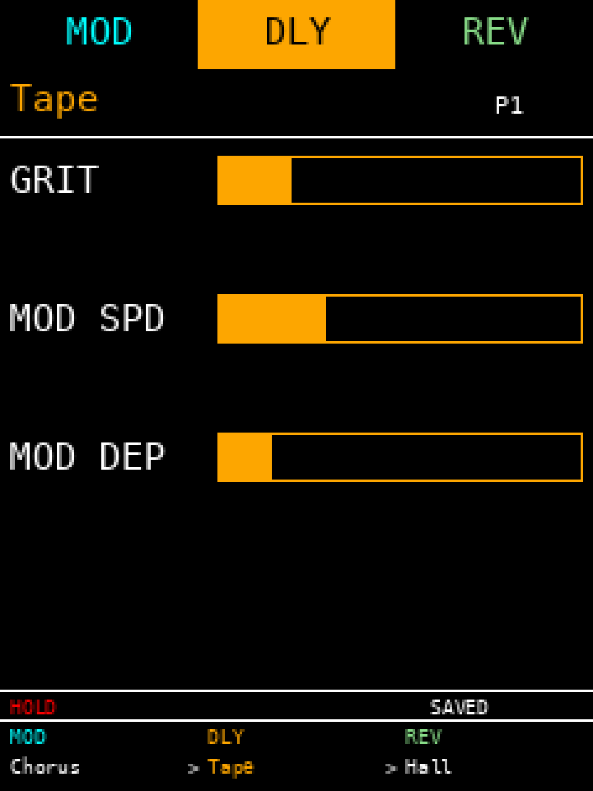

## Front panel

| Control          | Function                                                       |
|------------------|----------------------------------------------------------------|
| **MOD** switch   | Toggle modulation stage on / off                               |
| **DLY** switch   | Toggle delay stage on / off                                    |
| **REV** switch   | Toggle reverb stage on / off                                   |
| **TAP** switch   | Tap tempo (short press) / hold (long press)                    |
| **MOD** LED      | Lit while MOD stage is engaged                                 |
| **DLY** LED      | Lit while DLY stage is engaged                                 |
| **REV** LED      | Lit while REV stage is engaged                                 |
| **Mode** encoder | Rotate: cycle modes within active page. Click: cycle pages. Hold + rotate: shift parameter encoders to params 5–7. |
| **P0..P3**       | Four parameter encoders — edit the four parameters shown for the active page. Hold the mode encoder to access params 5–7. |

---

## Display

The pedal features a 240×320 ST7789 color TFT screen. The display is divided into a header, parameter list, status bar, and signal chain strip. To prevent clutter and ensure maximum legibility, the interface shifts between normal and shifted layouts depending on whether the Mode encoder is held.

### Screen Layouts

| Normal Screen Layout (Params 1–4) | Shifted Screen Layout (Params 5–7) |
| :---: | :---: |
|  |  |

- **Tab strip:** The top row displays page tabs (`MOD`, `DLY`, `REV`). The active page is highlighted with a solid accent color fill and black text. Inactive tabs display text in their respective accent color on a black background (cyan = MOD, orange = DLY, mint green = REV).
- **Mode name & Preset slot:** Directly below the tab strip, the active effect mode (algorithm) is drawn in the accent color, and the current preset slot (`P1`..`P8`) is shown on the right in white.
- **Parameter rows:** The screen displays up to four parameter rows at a time, each consisting of a parameter label and its value.
  - **Normal layout (default):** Displays parameters 1–4 with corresponding values.
  - **Shifted layout (holding down Mode encoder):** Displays parameters 5–7. The fourth parameter row remains blank.
  - **Value rendering:** Continuous parameters are shown as outlined horizontal progress bars filled with the page's accent color. Discrete selector parameters (such as Modulation's `P2`/`TYPE` parameter) render their current setting as a text label (e.g., "dBUCKET", "MULTI", "SILVER") in the accent color.
- **Status row:** Shows status notifications. `"HOLD"` appears in red on the left when reverb hold/freeze is active. Preset operations will briefly flash status flags on the right: `"SAVED"` (white), `"LOAD"` (white), or `"ERR"` (red).
- **Chain strip:** The bottom area displays the audio signal flow: `MOD > DLY > REV`. It is divided into columns for each stage:
  - The top line displays the stage tag (`MOD`, `DLY`, `REV`) in its accent color if engaged, or dimmed grey if bypassed.
  - The bottom line displays the name of the active algorithm. The active editing page's algorithm name is highlighted in its accent color, while other engaged stages are shown in white.
  - A bypassed stage dims its label and draws a horizontal strikethrough across the algorithm name.

